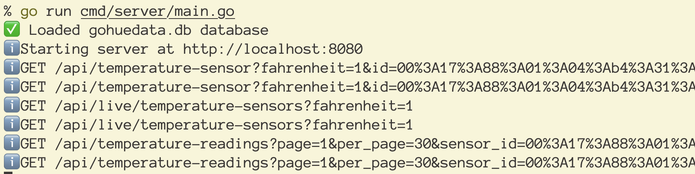
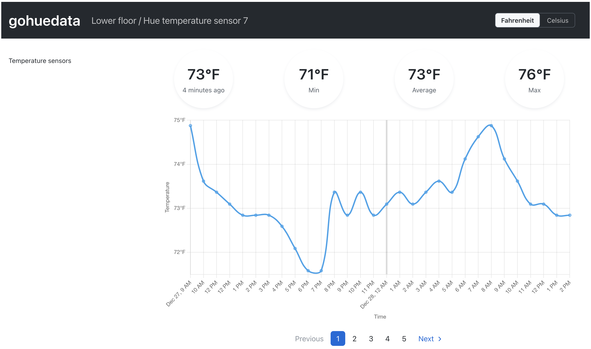

# gohuedata

This is a work in progress that provides a command-line tool written in Go to get data from your Philips Hue system
and record timestamped data in a SQLite database for your later use. It also provides a simple server to expose the
recorded historical data in a JSON API.

I built this using Go version 1.19.4 on macOS.

## How to run

### Fetch data from your Hue devices and record in database


You need to start recording your Philips Hue data so that you capture, for example, temperature readings from your
temperature sensors over time, and which lights are on when. This is done via the gohuedata script:

1. `cp config.yml.example config.yml`

    You can move the config.yml file wherever you want or rename it, but you'll need to pass the `-config` option and specify its path if you do.

1. Update config.yml with details about your Philips Hue bridges. See [Get started](https://developers.meethue.com/develop/get-started-2/) docs from Philips about how to get your bridge IP address and a username.

    The configuration file supports these options:

    - `temperature_units` - either `"F"` or `"C"` to specify Fahrenheit or Celsius
    - `database_file` - specify a path for a SQLite database where data from your Philips Hue devices will be recorded
    - `bridges` - a list of your Philips Hue bridges, each with the following properties:

        - `name` - the name of your bridge
        - `ip_address` - the IP address of the bridge, e.g, `"192.168.1.2"`
        - `username` - the username you configured on your bridge via a CLIP command (see https://developers.meethue.com/develop/get-started-2/)

1. `go run cmd/gohuedata/main.go`

    You will be prompted to select a bridge if your config file specifies more than one. By default, all lights and
    sensors on the selected bridge will be shown. The current temperature for each Philips Hue temperature sensor will also be recorded in the specified SQLite database.

1. Optional: set up a cron job to run the script periodically to log data. For example, on macOS, run `crontab -e` and add a line like this to run gohuedata [every hour](https://crontab.guru/every-hour):

    `0 * * * * cd /path/to/gohuedata && /usr/local/bin/go run cmd/gohuedata/main.go -sensors temperature -b -1 -config /path/to/your-config-file.yml`

    If you want to preserve log messages, you can create a log directory: `mkdir ~/Documents/gohuedata-logs`. Then set your cron job to:

    `0 * * * * cd /path/to/gohuedata && /usr/local/bin/go run cmd/gohuedata/main.go -sensors temperature -b -1 -config /path/to/your-config-file.yml -quiet=true >/path/to/gohuedata-logs/stdout.log 2>/path/to/gohuedata-logs/stderr.log`

#### Options for gohuedata

- **`-b`** - Specify a bridge via the index (starting at 1) of the bridge in your config file. For example, to specify
the first bridge in your config:

    `go run cmd/gohuedata/main.go -b 1`

    To specify that data should be loaded from all Philips Hue bridges specified in the config file, pass `-1`:

    `go run cmd/gohuedata/main.go -b=-1`

- **`-lights`** - Whether to fetch lights on the chosen bridge. Choose between `all` and `none`. Defaults to `all`.
Example:

    `go run cmd/gohuedata/main.go -lights none`

- **`-sensors`** - Which sensors to display from the chosen bridge, if any. Choose between `all`, `temperature`,
`motion`, and `none`. Defaults to `all`. Example:

    `go run cmd/gohuedata/main.go -sensors temperature`

- **`-t`** - Which units to use for temperature display, to override the `temperature_units` setting in config file.
Choose between `F` for Fahrenheit and `C` for Celsius. Defaults to the config file setting. Example:

    `go run cmd/gohuedata/main.go -t C`

- **`-config`** - Specify the path to the YAML configuration file. Defaults to "config.yml" if omitted. Example:

    `go run cmd/gohuedata/main.go -config ~/my_gohuedata_configuration.yml`

- **`-quiet`** - Quiet mode to suppress how much output is made. Choose from `true` for quiet mode enabled or `false` for disabled. Defaults to `false`. Example:

    `go run cmd/gohuedata/main.go -quiet=true`

### Start API server to surface the data you've logged



Once you've logged some data from your Philips Hue devices, you can expose that data via an API to see how, for
example, your home temperatures have changed over time.

1. `go run cmd/server/main.go`

    This will start a server at http://localhost:8080. The goal of this web server is to provide an API to surface the
    historical data the gohuedata command has recorded in the database, as well as provide visualizations of that
    data via a React frontend (see below).

#### Options for the server

- **`-config`** - Specify the path to the YAML configuration file. Defaults to "config.yml" if omitted. Example:

    `go run cmd/server/main.go -config ~/my_gohuedata_configuration.yml`

- **`-p`** - Port to start the server on. Defaults to 8080. Example:

    `go run cmd/server/main.go -p 3000`

- **`-fp`** - Port the frontend will run on. Defaults to 4000. Example:

    `go run cmd/server/main.go -fp 3456`

#### API endpoints

Responses will be in JSON.

- `/api/temperature-sensor`

    Parameters:

    - `id` - specify which temperature sensor to load
    - `fahrenheit` - optional; pass '1' to get temperatures in Fahrenheit, '0' for Celsius; defaults to '1'

- `/api/temperature-sensors`

    Parameters:

    - `bridge` - optional; name of the Philips Hue bridge whose sensors should be returned; case insensitive; if omitted, sensors from all bridges will be returned
    - `page` - optional integer page of sensors to load; defaults to 1
    - `per_page` - optional integer number of sensors to load per page; defaults to 10

- `/api/live/temperature-sensors`

    Parameters:

    - `bridge` - optional; name of the Philips Hue bridge whose sensors should be returned; case insensitive; if omitted, sensors from all bridges will be returned
    - `fahrenheit` - optional; pass '1' to get temperatures in Fahrenheit, '0' for Celsius; defaults to '1'

- `/api/temperature-readings`

    Parameters:

    - `bridge` - optional; name of the Philips Hue bridge whose sensors' readings should be returned; case insensitive; if omitted, readings from all bridges will be returned
    - `sensor_id` - specify which temperature sensor's temperature readings to load
    - `fahrenheit` - optional; pass '1' to get temperatures in Fahrenheit, '0' for Celsius; defaults to '1'
    - `updated_since` - optional; specify a timestamp for when a reading was made; only those on or after this time will be included
    - `updated_before` - optional; specify a timestamp for when a reading was made; only those from before this time will be included

- `/api/live/groups`

    Parameters:

    - `bridge` - optional; name of the Philips Hue bridge whose groups should be returned; case insensitive; if omitted, groups from all bridges will be returned

- `/api/group`

    Parameters:

    - `bridge` - required; name of the Philips Hue bridge associated with the group to be returned; case insensitive
    - `id` - specify which group to load

### Start frontend to view your data

|Temperature sensors list|Single temperature sensor|
|---|---|
|||

#### With live updates

If you want to change the frontend and see your changes live:

```sh
cd ui
npm install
npm run dev
```

This will launch the React app and open http://localhost:5173 in your browser. You can change the port used for the frontend via the `PORT` environment variable. If you do so, you'll want to pass the same port via the `-fp` option when launching the server.

#### Static

_TODO:_ update for Vite.

```sh
cd ui
npm run build
cd ../
go run cmd/server/main.go
```

The Go server running at http://localhost:8080 (by default; see the `-p` server option above for how to use a
different port) will serve up the static frontend.

## Thanks

Thanks to the developers of these libraries that gohuedata is built with:

- [mattn/go-sqlite3](https://github.com/mattn/go-sqlite3)
- [react-chartjs-2](https://react-chartjs-2.js.org/)
